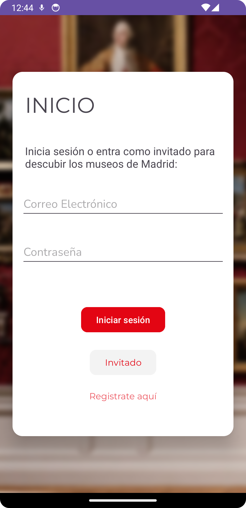
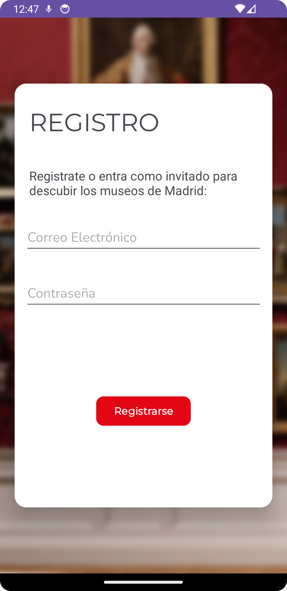
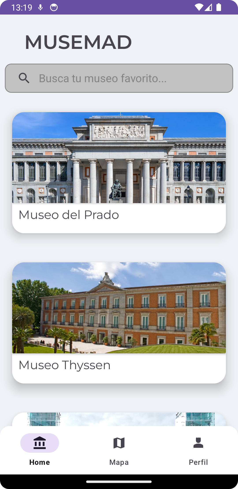
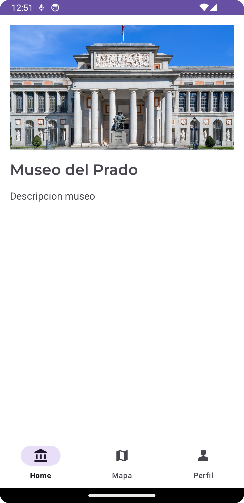
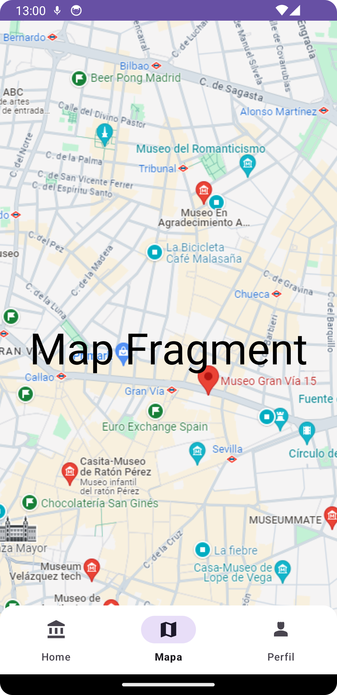
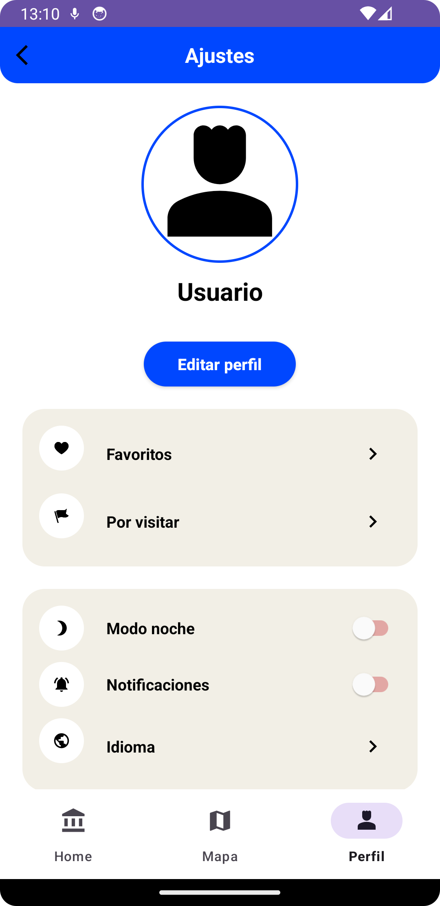

# MUSEMAD

>### Prototipo en [Figma](https://www.figma.com/file/7Y4QOjUOfIgEKFnunyJNft/MuseMad?type=design&node-id=3%3A33&mode=design&t=neoJ5mivNpkyReKs-1)

## Login

## Register

## Home

#### Main
##### En el home principal, contamos con un *AppBarLayout* con el título de la aplicación y un *SearchView* para filtrar los museos. Más abajo tenemos un *RecyclerView* con *CardViews*, las cuales muestran una foto y el nombre del museo, además estas tarjetas son clickables y nos mandarán a otro fragment con información adicional del museo

#### Info Museo

## Mapa

#### Mapa

## Perfil

#### Perfil

