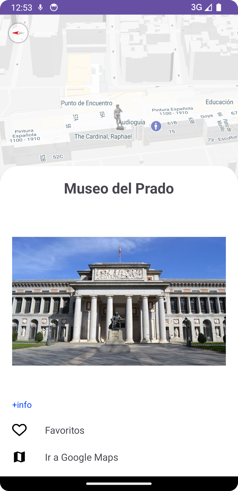

# MUSEMAD

>### Prototipo en [Figma](https://www.figma.com/file/7Y4QOjUOfIgEKFnunyJNft/MuseMad?type=design&node-id=3%3A33&mode=design&t=neoJ5mivNpkyReKs-1)

## Login

## Register

## Home

#### Main

#### Info Museo

## Mapa

#### Mapa

## Perfil

#### Perfil

