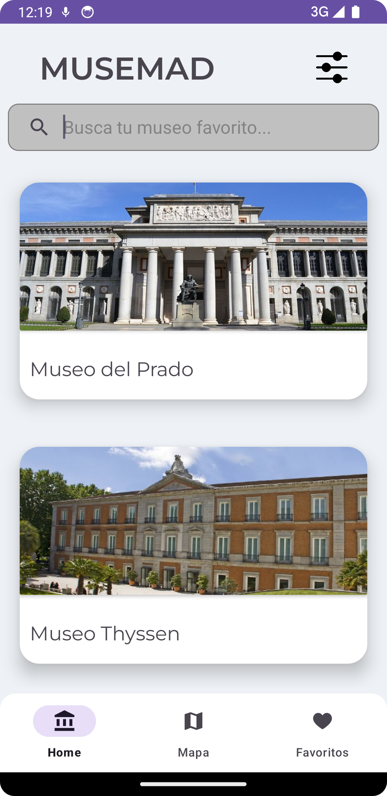

# MUSEMAD

>### Prototipo en [Figma](https://www.figma.com/file/7Y4QOjUOfIgEKFnunyJNft/MuseMad?type=design&node-id=3%3A33&mode=design&t=neoJ5mivNpkyReKs-1)

## Login
##### En el login, contamos con 2 botónes, uno para iniciar sesión con nuestros credenciales y otro para entrar como invitado a la aplicación, además también contamos con un *TextView* clickable el cual nos mandará a la Activity de Register

## Register
##### En el register contamos con un dos campos para poner nuestros credenciales y un botón para registrarse, que creará nuestro usuario en la Base de datos de *Firebase*

## Home

#### Main
##### En el home principal, contamos con un *AppBarLayout* con el título de la aplicación y un *SearchView* para filtrar los museos. Más abajo tenemos un *RecyclerView* con *CardViews*, las cuales muestran una foto y el nombre del museo, además estas tarjetas son clickables y nos mandarán a otro fragment con información adicional del museo

##### El *AppBarLayout* se contraerá al bajar en el *RecyclerView* dejando así una vista más clara de las tarjetas con los museos

##### Por último también contamos con un *SearchView* funcional para filtrar los museos por su nombre

#### Settings

#### Detail Museo
##### Al pulsar en una de las tarjetas, nos enviará a una nueva vista en la que podremos ver los detalles del museo además de agregarlo a favoritos usando el botón de la derecha, para así poderlo ver en nuestra vista de favoritos

## Mapa

#### Mapa
##### Utilizando la API de *Google Maps* hemos hecho un mapa con distintos símbolos los cuales representan la ubicación de los distintos museos, al pulsar en uno de estos símbolos, podremos abrir *Google Maps* con la dirección de este museo o abrir la vista de *DetailMuseum* desde aqui

## Favoritos

#### Favoritos
##### En el apartado de *Favoritos* veremos los museos que tengamos agregados a favoritos en una vista distinta, para así poderlos buscar más facilmente si es que un museo nos ha gustado o queremos visitarlo próximamente

